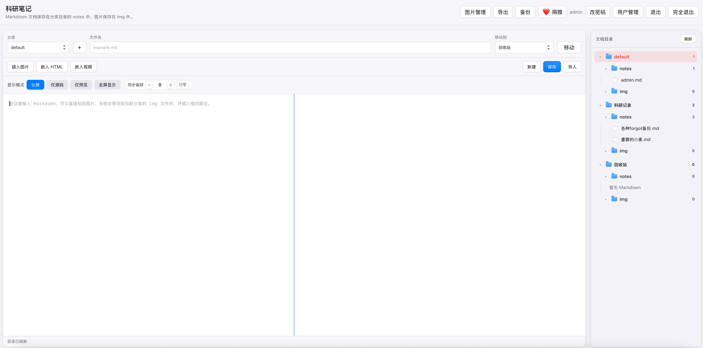

# MarkNotes 科研笔记系统

MarkNotes 是一个使用 Go 标准库实现的轻量级科研笔记管理系统，支持 Markdown 编辑、预览、分类管理、图片管理、导入导出、全量备份、数学公式渲染和移动端适配。

系统适合用于个人科研记录、实验笔记、学习笔记、技术文档和项目资料整理。

## 功能演示

macOS 风格主界面：左侧为源码/预览分屏编辑区（支持仅源码、仅预览、全屏显示），右侧为 Finder 风格的分类文档目录树。



源码与预览**双向同步定位**：在源码区按住 `Cmd`（或 `Ctrl`）点击任意位置，预览会高亮并滚动到对应块；在预览区按住 `Cmd`（或 `Ctrl`）点击区块，光标跳回源码对应行；点击目录（TOC）链接时，预览与源码同时定位到对应标题。普通点击和滚动不会触发同步。工具栏的**同步偏移**微调条可手动补偿行号偏差，并保存为当前用户的默认值（服务器端、跨设备）。

## 功能特性

- 支持 Markdown 编辑与实时预览
- 支持 CommonMark 与 GFM 扩展
- 支持表格、任务列表、删除线、引用、代码块等 Markdown 语法
- 支持 MathJax 数学公式渲染
- 支持原始 HTML 嵌入
- 支持网络视频嵌入
- 支持图片粘贴、图片插入和图片预览
- 支持拖拽调整图片和视频尺寸
- 支持图片管理界面：集中查看所有分类图片，支持单张删除与多选批量删除
- 支持在目录树中右键删除图片
- 支持按分类管理 Markdown 文档
- 每个分类拥有独立的 `notes/` 和 `img/` 文件夹
- 支持 Markdown 导入
- 支持 Markdown 导出
- 支持全量备份
- 支持文档移动、重命名、删除和恢复
- 支持分类新建、重命名、删除、移动和排序
- 支持回收站机制，删除内容默认保留七天
- 支持自动保存
- 支持编辑器视图切换
- 支持源码与预览双向同步定位（Cmd/Ctrl+点击 或 点击目录链接触发），并提供同步偏移微调（可保存为用户默认值）
- 支持通过 `BASE_PATH` 部署到网站子路径
- 支持登录验证
- 支持多用户：每个用户拥有独立、互不可见的笔记数据，密码以 bcrypt 哈希存储
- 管理员可创建/删除用户、重置密码；普通用户可自助修改密码
- 支持文档目录（TOC）：编辑区右侧常驻显示当前文档大纲，普通模式与全屏均可用，支持点击跳转
- 适配桌面端和移动端

## 技术架构

系统使用 Go 标准库实现 Web 服务，主要文件结构如下：

```
main.go
go.mod
go.sum
templates/
  index.html
  login.html
static/
  app.js
  style.css
categories/
  default/
    notes/
    img/
```

核心说明：

- 后端使用 Go 提供 Web 服务和文件读写接口
- Markdown 渲染使用 goldmark
- 前端使用原生 HTML、CSS 和 JavaScript
- 数学公式使用 MathJax 渲染
- 数据直接保存在本地文件系统中
- 不依赖数据库

## 数据目录结构

笔记数据按「用户 / 分类」两级存储在 `data/` 目录下，每个用户拥有独立的数据子目录；用户账号与密码哈希保存在 `users.json`：

```
data/
  用户名/
    default/
      notes/
      img/
    分类名/
      notes/
      img/
    回收站/
      notes/
      img/
      .trash.json
    .category_order.json
users.json   # 用户账号与 bcrypt 密码哈希
```

每个分类包含两个主要目录：

- `notes/` —— Markdown 文档
- `img/` —— 图片文件

Markdown 中的图片使用相对路径引用，例如：

```html

```

## 启动方式

在项目根目录执行：

```bash
go run .
```

默认访问地址：

```
http://localhost:44444
```

### 启动参数

| 参数 | 对应环境变量 | 默认值 | 说明 |
| --- | --- | --- | --- |
| `-data` | `MARKNOTES_DATA` | macOS：iCloud 云盘 `科研笔记--麦子`；其他系统：`.` | 数据存放目录，其中保存 `users.json` 与 `data/` 笔记数据 |
| `-addr` | `MARKNOTES_ADDR` | `:44444` | 监听地址 |

macOS 上的默认数据目录完整路径为 `~/Library/Mobile Documents/com~apple~CloudDocs/科研笔记--麦子`，存放在其中的笔记会随 iCloud 自动同步。如果想继续使用项目目录下的旧数据，用 `go run . -data .` 启动，或把现有的 `data/` 和 `users.json` 移动到 iCloud 目录中。

例如把数据存放到指定目录并换端口：

```bash
go run . -data ~/MarkNotesData -addr :8080
```

目录不存在时会自动创建。命令行参数优先于环境变量。

## 打包成独立应用

已打包好的 macOS 版可在 [Releases 页面](https://github.com/xiaomai199-cpu/xiaomaiNotes/releases)直接下载（`MarkNotes-macOS.zip` 内含 `MarkNotes.app`、命令行版 `marknotes` 和 `停止MarkNotes服务.command`）。应用为 ad-hoc 签名（未经 Apple 公证），首次打开如被拦截请右键 → 打开；首次启动时 macOS 会询问是否允许访问 iCloud 云盘，请点「允许」（数据目录在 iCloud 中，拒绝后应用将无法启动，可到「系统设置 → 隐私与安全性 → 文件和文件夹」重新开启）。

模板和静态资源已通过 `go:embed` 嵌入二进制，编译产物是单文件应用，可拷贝到任意位置运行：

```bash
./build-app.sh
```

生成：

- `dist/marknotes`：单文件可执行程序，`./marknotes -data <数据目录> [-addr :端口]` 即可运行，无需附带 `templates/`、`static/`；加 `-window` 则以独立窗口模式运行（仅 macOS）
- `dist/MarkNotes.app`：macOS 独立窗口应用，双击直接打开原生 WebView 窗口（不依赖浏览器）；数据默认存放在 iCloud 云盘的 `科研笔记--麦子` 文件夹（`~/Library/Mobile Documents/com~apple~CloudDocs/科研笔记--麦子`，随 iCloud 自动同步），如需自定义，在 `~/Library/Application Support/MarkNotes` 下创建 `datadir.txt`，第一行写上想用的数据目录绝对路径
- `dist/停止MarkNotes服务.command`：双击强制停止后台服务（备用）

打包脚本会自动对 `MarkNotes.app` 做 ad-hoc 签名——完全无签名的 app 会被 macOS 15 静默拒绝访问 iCloud 云盘（读取 `users.json` 报 `operation not permitted`，进程直接退出，窗口弹不出来）。

关闭窗口只是隐藏，服务驻留后台，局域网内其他设备（如手机）仍可通过 `http://<电脑IP>:44444/` 访问，点 Dock 图标可重新打开窗口；要彻底退出，用页面右上角的「完全退出」按钮（窗口模式专有，浏览器里也可用）或 Cmd+Q。服务日志在 `~/Library/Application Support/MarkNotes/marknotes.log`。

交叉编译其他平台（例如 Linux 服务器、Windows）：

```bash
GOOS=linux GOARCH=amd64 go build -ldflags "-s -w" -o marknotes-linux .
GOOS=windows GOARCH=amd64 go build -ldflags "-s -w" -o marknotes.exe .
```

## 登录配置与多用户

系统支持多用户，用户信息保存在 `users.json`，密码以 bcrypt 哈希存储。

首次启动若 `users.json` 不存在，会自动创建管理员账号 `admin`，初始密码取自环境变量 `ADMIN_PASS`（默认 `admin123`）：

```bash
ADMIN_PASS='your-strong-password' go run .
```

权限说明：

- **管理员**：登录后在首页顶栏点击「用户管理」进入 `/admin` 页面，可创建用户、删除用户、重置任意用户密码
- **普通用户**：登录后在首页顶栏点击「改密码」修改自己的密码（需验证旧密码）

建议部署时通过 `ADMIN_PASS` 设置强密码，并尽快在用户管理页面调整账号。每个用户的数据互相隔离，互不可见。

## 子路径部署

如果需要部署到网站子路径，例如：

```
https://example.com/MarkNotes/
```

可以通过 `BASE_PATH` 设置访问路径前缀：

```bash
BASE_PATH=/MarkNotes go run .
```

此时应用内的登录、静态资源、API、图片、导出和备份链接都会自动使用 `/MarkNotes` 前缀。

### 后台运行示例

在服务器上可以使用 `nohup` 后台运行：

```bash
nohup env BASE_PATH=/MarkNotes go run . > /tmp/marknotes.log 2>&1 &
```

查看日志：

```bash
tail -f /tmp/marknotes.log
```

停止占用 44444 端口的服务：

```bash
sudo fuser -k 44444/tcp
```

### Nginx 子路径反向代理示例

如果需要通过 Nginx 代理到 `/MarkNotes/`，可参考：

```nginx
location = /MarkNotes {
    return 301 /MarkNotes/;
}

location ^~ /MarkNotes/ {
    proxy_pass http://127.0.0.1:44444;
    proxy_set_header Host $host;
    proxy_set_header X-Real-IP $remote_addr;
    proxy_set_header X-Forwarded-For $proxy_add_x_forwarded_for;
    proxy_set_header X-Forwarded-Proto $scheme;
    proxy_redirect off;
}
```

## 基本使用说明

### 新建分类

在页面顶部分类区域点击 `+` 按钮，输入分类名称。

系统会自动创建：

```
categories/分类名/notes/
categories/分类名/img/
```

### 新建 Markdown

支持两种方式：

- 点击顶部 **新建** 按钮
- 在右侧目录树的某个 `notes` 文件夹上右键，选择 **新建文档**

新建后，文档会保存到当前分类的 `notes/` 目录中。

### 保存 Markdown

编辑内容后可以点击顶部 **保存**。

系统也支持自动保存：

- 输入或修改 Markdown 内容后自动保存
- 修改文件名后自动保存
- 插入图片后自动保存
- 粘贴图片后自动保存
- 嵌入 HTML 或视频后自动保存
- 调整图片或视频尺寸后自动保存
- 切换文档或移动文档前会尝试自动保存

### 选择分类和文档

右侧目录树中：

- 当前分类会高亮显示
- 当前 Markdown 文档会高亮显示
- 可勾选多个 Markdown 文档用于导出

未选择分类时，系统默认使用 `default` 分类。

## Markdown 支持

系统支持常见 Markdown 语法。

### 标题

```markdown
# 一级标题
## 二级标题
### 三级标题
```

### 表格

```markdown
| 项目 | 结果 |
|---|---|
| A | 通过 |
```

### 任务列表

```markdown
- [x] 已完成
- [ ] 待处理
```

### 删除线

```markdown
~~删除这段~~
```

### 引用

```markdown
> 这是一段引用。
```

### 代码块

````markdown
```go
fmt.Println("hello")
```
````

### 数学公式

行内公式：

```markdown
质能方程为 $E=mc^2$。
```

块级公式：

```markdown
$$
I_D = \frac{1}{2}\mu C_{ox}\frac{W}{L}(V_{GS}-V_{TH})^2
$$
```

也支持 LaTeX 风格分隔符：

```markdown
\( a^2+b^2=c^2 \)

\[
V = IR
\]
```

## 图片功能

### 粘贴图片

在编辑器中直接粘贴图片，系统会将图片保存到当前分类：

```
categories/当前分类/img/
```

并在 Markdown 中插入类似内容：

```html

```

### 插入已有图片

点击编辑器上方的 **插入图片** 按钮，可以从所有分类的 `img/` 文件夹中选择图片。

规则：

- 如果图片已经在当前分类，直接插入相对路径
- 如果图片来自其他分类，会先复制到当前分类的 `img/` 文件夹，再插入相对路径

也可以在右侧目录树中展开当前分类的 `img` 文件夹，点击图片直接插入。

### 图片预览与尺寸调整

- 鼠标悬停在右侧 `img` 文件夹中的图片上，会显示大图预览
- 鼠标悬停在插入图片弹窗的缩略图上，也会显示大图预览
- 在预览区可以拖拽调整图片尺寸
- 调整尺寸后，系统会更新 Markdown 中的 `width` 或 `height` 属性

### 图片管理

点击顶栏的 **图片管理** 按钮，打开图片管理界面，可在同一页面集中管理所有分类 `img/` 文件夹中的图片：

- 以缩略图网格展示全部图片，并标注所属分类、文件名和大小
- 鼠标悬停可查看大图预览
- 每张图片下方提供 **删除** 按钮，可单张删除
- 支持**多选**：勾选图片左上角的复选框，或用顶部 **全选** 一次性选择，工具栏会实时显示已选数量
- 选中后点击 **删除选中** 可一次性**批量删除**多张图片

### 删除图片

有两种删除图片的入口：

- **图片管理界面**：单张删除或多选批量删除
- **目录树右键**：展开某个分类的 `img` 文件夹，在图片上右键，选择 **删除图片**

> 注意：以上两种删除都是**直接物理删除、不进回收站、不可恢复**，删除前会有二次确认。删除被文档引用的图片后，相关文档会显示坏图。
>
> 如果只是想删除文档并保留图片的恢复可能，请改用「删除文档」——删除文档时引用的图片会随文档一起进入回收站，默认保留七天，可随文档一并恢复。

## 导入与导出

### 导入 Markdown

点击顶部 **导入** 按钮。

支持导入：

- `.md`
- `.markdown`
- 按本系统导出结构形成的 `.zip`
- 按全量备份结构形成的 `.zip`

单个 Markdown 文件和 `notes/img` 结构的压缩包会导入当前分类。

如果压缩包中包含：

```
categories/分类名/notes/
categories/分类名/img/
```

系统会按压缩包里的分类名恢复到对应分类。

导入时如果遇到同名分类、Markdown 或图片，系统会询问是否覆盖。取消覆盖时，会自动生成新名称保留原内容。

### 导出 Markdown

在右侧目录树勾选一个或多个 Markdown 文件，然后点击顶部 **导出**。

系统会导出：

- 已勾选的 Markdown 文档
- 这些 Markdown 引用到的图片

导出压缩包结构：

```
notes/
  selected.md
img/
  referenced-image.png
```

### 全量备份

点击顶部 **备份** 按钮。

系统会压缩整个 `categories/` 目录，并保持所有分类、`notes/`、`img/` 的原始结构。

备份结构示例：

```
categories/
  default/
    notes/
    img/
  分类名/
    notes/
    img/
```

## 文档管理

### 移动 Markdown

在右侧目录树中拖动 Markdown 文件到目标分类或目标分类的 `notes` 文件夹上。

系统会：

- 移动 Markdown 文件
- 解析 Markdown 中引用的图片
- 将相关图片移动到目标分类的 `img` 文件夹
- 如发生重名，自动生成新文件名

### 重命名 Markdown

在右侧目录树中的 Markdown 文件上右键，选择 **重命名**，输入新文件名即可。

### 删除 Markdown

在 Markdown 文件上右键，选择 **删除文档**。

文档会进入 **回收站** 分类，并默认保留七天。

### 恢复 Markdown

展开右侧目录树中的 **回收站 > notes**，在需要恢复的 Markdown 上右键，选择 **恢复**。

系统会恢复到原分类。如果原文件名或图片名冲突，会自动生成新名称。

## 分类管理

### 移动分类

拖动一个分类文件夹到另一个分类文件夹上。

系统会把源分类下的所有 Markdown 和相关图片合并移动到目标分类。

限制：

- `default` 不支持作为源分类拖动
- `回收站` 不支持这样拖动
- 不允许拖动到 `回收站` 分类

### 调整分类顺序

在右侧分类文件夹上右键，可以选择：

- 上移分类
- 下移分类

分类顺序会保存到：

```
categories/.category_order.json
```

### 重命名分类

在分类文件夹上右键，选择 **重命名分类**，输入新名称后，系统会重命名整个分类目录。

### 删除分类

在分类文件夹上右键，选择 **删除分类**。

该分类下的 Markdown 会进入回收站，默认保留七天。

限制：

- `default` 分类不能删除
- `回收站` 分类不能删除

## 回收站机制

删除 Markdown 时不会立即物理删除，而是移动到：

```
categories/回收站/notes/
```

相关图片会移动到：

```
categories/回收站/img/
```

删除元数据保存在：

```
categories/回收站/.trash.json
```

系统会记录：

- 原分类
- 原文件名
- 删除时间
- 图片映射关系

回收站内容默认保留七天，过期后自动清理。

## 编辑器视图模式

编辑器支持四种视图模式：

- **分屏**：同时显示 Markdown 源码和预览
- **仅源码**：只显示 Markdown 编辑器
- **仅预览**：只显示渲染结果
- **全屏显示**：隐藏顶栏、按钮、目录树和状态栏，仅保留写作区域

全屏模式下可通过按钮或 `Esc` 键退出。

## 文档目录（TOC）

编辑器右侧提供一个常驻的文档目录（大纲）面板：

- 预览可见（分屏或仅预览）且文档包含标题时，右侧自动显示当前文档目录
- 自动提取各级标题（H1–H6），并按层级缩进显示
- 点击目录项可跳转到预览中的对应标题位置，并同步滚动编辑器到对应源码行
- 切换到「仅源码」或文档没有任何标题时，目录面板自动隐藏
- 普通模式与全屏模式均可使用；窄屏（移动端）下为节省空间不显示目录

## 源码与预览同步定位

编辑器与预览区支持按需双向同步定位（普通点击和滚动不会触发同步）：

- 在编辑器中按住 `Cmd`（macOS）或 `Ctrl`（Windows/Linux）点击，预览区滚动到对应内容，并与光标所在行对齐到相同的屏幕高度
- 在预览区按住 `Cmd` / `Ctrl` 点击内容，编辑器光标定位到对应 Markdown 源码行，并滚动到与点击位置相同的屏幕高度
- 点击目录（TOC）链接时，预览与编辑器同时滚动，标题在两侧对齐到顶部
- 同步时当前关注块会高亮显示，便于在长文档中定位内容

同步定位按点击位置的行内容对齐：编辑器行的像素位置用镜像元素精确测量（计入长行软换行），段落内部按行数比例插值，常规文本误差在 1～2 行以内；段落中混有大图片、公式等高度异常内容时可能略有偏移，可用工具栏的**同步偏移**微调。

## 文件安全与迁移

所有用户、Markdown 和图片都保存在本地目录与文件中，没有使用数据库。

迁移时通常只需要保留：

```
data/          # 全部用户的笔记与图片
users.json     # 用户账号与密码哈希
go.mod
go.sum
main.go
templates/
static/
```

如果只公开代码仓库，务必不要上传用户笔记数据和账号文件，可在 `.gitignore` 中加入：

```gitignore
data/
users.json
```

这样可避免提交个人笔记、图片、密码哈希或隐私内容。

## 推荐 Git 忽略规则

公开仓库建议使用类似 `.gitignore`：

```gitignore
.DS_Store

# Go / build
*.log
tmp/
dist/
build/

# 本地笔记数据与账号文件，不建议公开
data/
users.json
/research-notes

# 环境变量和编辑器配置
.env
.env.*
.vscode/
```

如果 `data/` 或 `users.json` 已经被 Git 跟踪过，需要执行：

```bash
git rm -r --cached data users.json
git add .gitignore
git commit -m "Remove local note data from repository"
```

这样会从 Git 仓库中移除这些文件，但保留本地文件。

## 安全建议

- 不要将 API Key、Token、服务器密码提交到仓库
- 不要公开个人笔记、图片、配置文件和隐私内容
- 部署时通过 `ADMIN_PASS` 设置强初始密码，并在用户管理页面管理账号
- 公开仓库前检查 Git 历史中是否包含密钥
- 如果 GitHub Push Protection 提示包含 secret，应立即重置对应密钥并清理提交历史

## 常用命令

启动：

```bash
go run .
```

使用自定义初始管理员密码启动：

```bash
ADMIN_PASS='your-strong-password' go run .
```

使用子路径启动：

```bash
BASE_PATH=/MarkNotes go run .
```

指定数据存放目录启动：

```bash
go run . -data ~/MarkNotesData
```

打包单文件应用与 macOS App：

```bash
./build-app.sh
```

后台运行：

```bash
nohup env BASE_PATH=/MarkNotes go run . > /tmp/marknotes.log 2>&1 &
```

查看日志：

```bash
tail -f /tmp/marknotes.log
```

停止服务：

```bash
sudo fuser -k 44444/tcp
```

## 项目定位

MarkNotes 面向个人科研记录和轻量级文档管理，特点是：

- 部署简单
- 数据结构清晰
- 文件可直接备份和迁移
- Markdown 与图片分离存储
- 不依赖数据库

适合私有化部署和个人长期维护。

## 爱心捐赠

如果 MarkNotes 对你有帮助，欢迎扫码请作者喝杯咖啡 ☕，这是对项目持续维护最好的支持：


